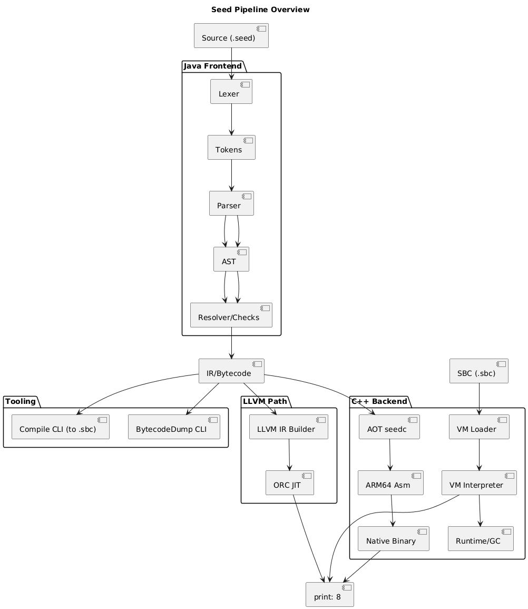

# Seed: a teaching compiler/VM

Seed is a step-by-step learning project covering how compilers and runtimes work, from source code to execution. It includes:
- A Java frontend (lexer, parser, semantic checks, interpreter)
- A stack-based IR/bytecode and textual .sbc format
- A C++ backend with:
  - A custom bytecode VM (interpreter)
  - An AOT (ahead-of-time) ARM64 codegen slice (seedc) for macOS/Apple Silicon
  - An optional LLVM ORC JIT slice (seedjit) using LLJIT
- Diagrams and verbose docs to connect concepts (HotSpot/Graal analogies)

Core compiler concepts (quick definitions)
- Frontend vs Backend:
  - Frontend: turns source text into a well-formed abstract representation and verifies meaning
    - Lexing (scanner): transforms characters into tokens (identifiers, numbers, operators)
    - Parsing: turns tokens into an AST (abstract syntax tree) according to a grammar
    - Static semantics (resolver/checks): builds symbol tables, checks arity/duplicates/types, reports diagnostics
  - Backend: lowers a verified program into a target for execution (bytecode VM, native code, or JIT)
    - IR/Bytecode: a target-agnostic instruction set thats easy to interpret and transform
    - Code generation: maps IR to a specific CPU/OS (AOT), or generates/executes code at runtime (JIT)
    - Runtime/GC: services like printing, memory management, garbage collection (planned)
- AOT vs JIT:
  - AOT: compile to a native binary ahead of time (e.g., seedc ’ ARM64 assembly ’ clang ’ executable)
  - JIT: compile on the fly in-process via an engine (e.g., LLVM ORC LLJIT), enabling dynamic optimization
- GC (planned): automatically reclaim memory for heap objects by tracing reachability (roots = VM stack + frames)

Repository layout
- docs/
  - README.md  start-here index and run commands
  - diagrams.md  PlantUML diagrams of the whole system
  - 02-parser-ast.md, 03-interpreter.md, 04-static-semantics.md, 05-ir-bytecode.md
  - 06-vm-gc.md  VM details and early GC notes
  - 07-aot-arm64.md  AOT slice (ARM64 assembly, Mach-O notes)
  - 08-llvm-jit.md  LLVM ORC JIT slice (LLJIT)
  - cpp-code-walkthrough.md  verbose, file-by-file explanation of the C++ code
- examples/  sample .seed programs
- java/  Java frontend (lexer/parser/interpreter/sema/bytecode) + CLIs
- src/include/seed/  shared C++ headers (bytecode, vm, codegen)
- src/cpp/  C++ sources:
  - vm/  VM interpreter, loader, (future) GC
  - codegen/  AOT (a64_emit.cpp), LLVM JIT (llvm_jit.cpp)
  - apps/  seedvm (VM), seedc (AOT), seedjit (JIT), seeddasm (bytecode disassembler)
- scripts/  helper scripts (e.g., disasm.sh for Mach-O binaries)
- tests/  C++ tests (sanity)

Quick start

1) Java frontend (build tools and generate bytecode)
- Requires: Java 17+, Maven
- Build and run tools:
  - cd seed/java
  - mvn -q -DskipTests package
  - Lex:   java -cp target/seed-frontend-0.0.1.jar com.seed.cli.LexDump ../examples/hello.seed
  - AST:   java -cp target/seed-frontend-0.0.1.jar com.seed.cli.AstDump ../examples/hello.seed
  - Run:   java -cp target/seed-frontend-0.0.1.jar com.seed.cli.Run     ../examples/hello.seed
  - .sbc:  java -cp target/seed-frontend-0.0.1.jar com.seed.cli.Compile ../examples/hello.seed ../out/hello.sbc

2) C++ VM (Track A, reference execution path)
- Requires: CMake, Clang or GCC
- Build and run:
  - cd seed
  - cmake -S . -B build -DCMAKE_BUILD_TYPE=Debug
  - cmake --build build -j
  - ./build/src/cpp/seedvm ./out/hello.sbc   # expected output: 8
- Disassemble binaries (macOS):
  - ./scripts/disasm.sh ./build/src/cpp/seedvm
    - Uses llvm-objdump when available; falls back to otool -tvV on macOS

3) AOT ARM64 (initial slice; macOS/Apple Silicon)
- Requires: clang (Apple), basic Mach-O toolchain
- Generate assembly and link:
  - ./build/src/cpp/seedc -S ./out/hello.sbc -o ./out/hello.s
  - clang -arch arm64 ./out/hello.s -o ./out/hello_aot
  - ./out/hello_aot
  - ./scripts/disasm.sh ./out/hello_aot
- Notes: This initial emitter is intentionally minimal for teaching sections/ABI/printf; VM and JIT are the canonical correctness references.

4) LLVM ORC JIT (Track B; optional)
- Requires: Homebrew LLVM on macOS (or a working LLVM install)
  - brew install llvm
- Configure with LLVM enabled:
  - cmake -S . -B build_llvm -DCMAKE_BUILD_TYPE=Debug \
      -DENABLE_LLVM=ON \
      -DLLVM_DIR=/opt/homebrew/opt/llvm/lib/cmake/llvm
  - cmake --build build_llvm -j
  - ./build_llvm/src/cpp/seedjit ./out/hello.sbc  # expected output: 8

Learning path (with docs)
- Start here: docs/README.md
- Then follow:
  1) 02-parser-ast.md (preceded by the lexer content in the Java sources)
  2) 03-interpreter.md
  3) 04-static-semantics.md
  4) 05-ir-bytecode.md
  5) 06-vm-gc.md (VM, early GC notes)
  6) 07-aot-arm64.md (AOT intro)
  7) 08-llvm-jit.md (JIT intro)
- Visual aids: docs/diagrams.md (PlantUML blocks for pipeline, frontend classes, VM flow, AOT, JIT, runtime model)
- Deep dive on C++: docs/cpp-code-walkthrough.md (file-by-file explanations, ABI notes, exercises)

HotSpot/Graal mapping crib sheet
- Frontend ’ javac/Graal frontend parsers and type checkers
- IR/Bytecode ’ HotSpot/Graal IR tiers (e.g., HIR/LIR) and JVM bytecode concepts
- VM Interpreter ’ HotSpot template interpreter (baseline execution)
- AOT ’ analogous to Graal Native Image / static compilation (limited here, for teaching)
- JIT ’ analogous to HotSpot C1/C2 or Graal JIT, but here via LLVM ORC LLJIT
- GC ’ design ideas towards generational GC with barriers and safepoints (planned)

Troubleshooting (macOS/ARM64)
- llvm-objdump errors with unsupported flags:
  - Our disasm.sh falls back to otool -tvV automatically
- clang linking warnings about -no_pie:
  - On recent macOS/ARM64, prefer correct Mach-O sections/relocations over forcing -no_pie
- printf prints garbage from AOT:
  - Varargs and register widths matter: x0 must hold the format pointer, integer arg must be in w1; preserve values around ADRP/ADD materialization

Contributing / exercises
- Try adding a new opcode (e.g., MOD) end-to-end (lexer ’ parser ’ compiler ’ VM)
- Enable a VM trace mode to print each executed instruction and stack state
- Generalize the AOT emitter to handle more bytecode patterns
- Extend the LLVM JIT to lower arbitrary bytecode to LLVM IR and experiment with optimization levels
- Prototype a tagged value representation + a simple mark-sweep GC

License
- Educational project; license TBD. For now, treat as all-rights-reserved for private learning unless a LICENSE file is added.