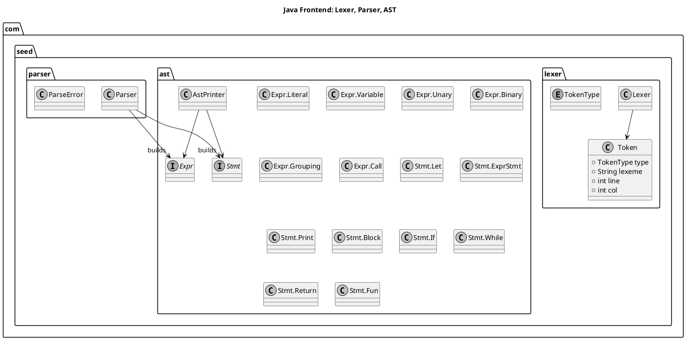
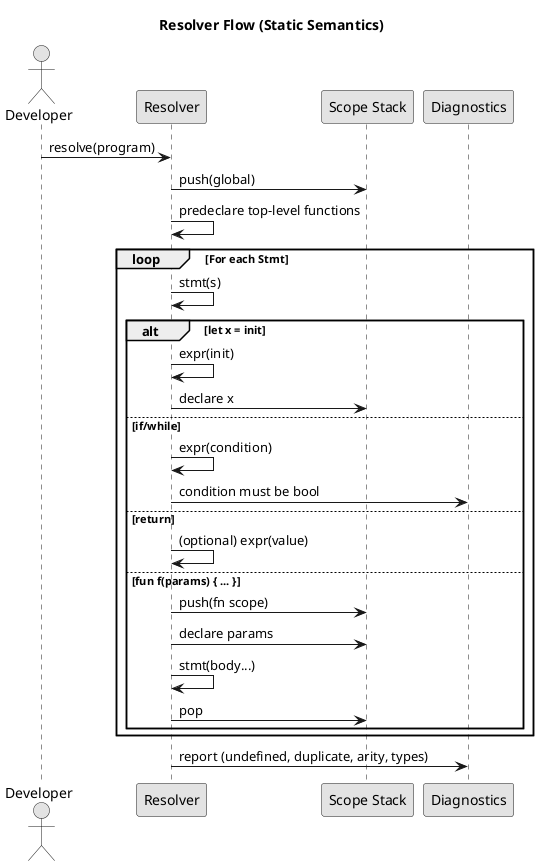
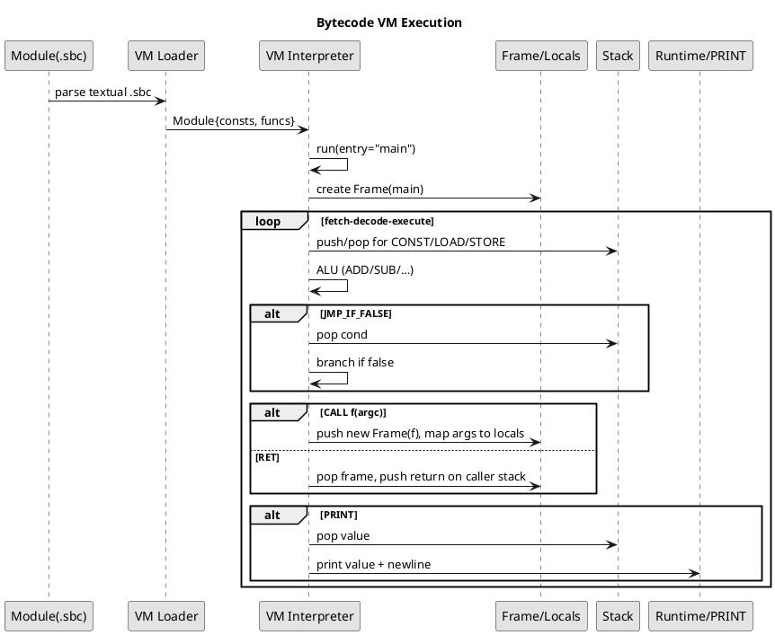
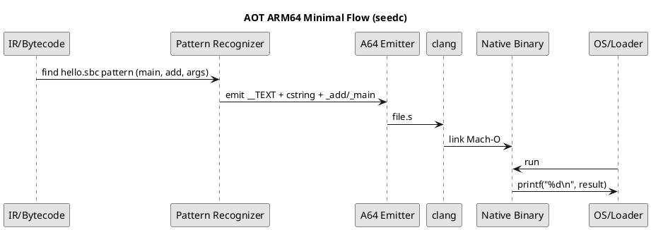
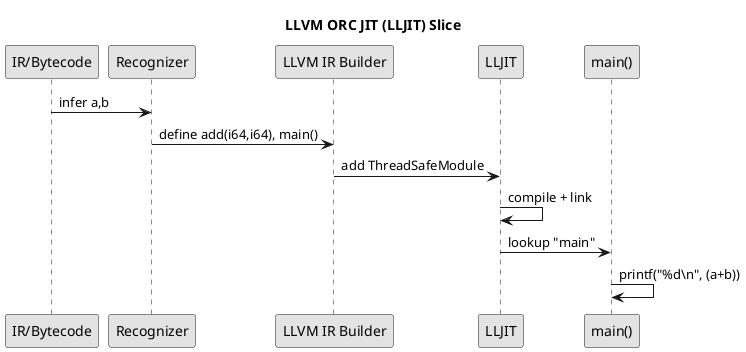
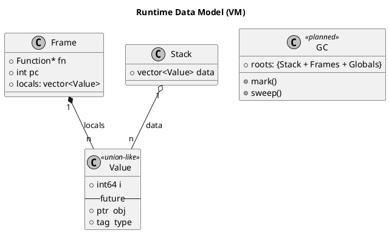

# Seed Compiler Diagrams (PlantUML)

This document provides PlantUML diagrams to visualize the architecture and data flow across the Seed project: frontend (Java), IR/bytecode, VM/runtime (C++), AOT ARM64, and LLVM JIT. You can render these with:
- VS Code “PlantUML” extension (with Graphviz installed), or
- plantuml.jar + Graphviz: java -jar plantuml.jar -tpng diagrams.md
- Or copy a single @startuml…@enduml block to an online PlantUML server.

1) Overview: End-to-End Pipeline
```plantuml
@startuml
skinparam monochrome true
title Seed Pipeline Overview

rectangle "Java Frontend" {
  [Lexer] --> [Tokens]
  [Parser] --> [AST]
  [Resolver/Checks]
  [AST] --> [IR/Bytecode]
}

rectangle "Tooling" {
  [BytecodeDump CLI]
  [Compile CLI (to .sbc)]
}

rectangle "C++ Backend" {
  [VM Loader] --> [VM Interpreter]
  [VM Interpreter] --> [Runtime/GC]
  [AOT seedc] --> [ARM64 Asm] --> [Native Binary]
}

rectangle "LLVM Path" {
  [LLVM IR Builder] --> [ORC JIT]
}

[Source (.seed)] --> [Lexer]
[Tokens] --> [Parser]
[Parser] --> [AST]
[AST] --> [Resolver/Checks]
[Resolver/Checks] --> [IR/Bytecode]
[IR/Bytecode] --> [BytecodeDump CLI]
[IR/Bytecode] --> [Compile CLI (to .sbc)]
[SBC (.sbc)] --> [VM Loader]
[VM Loader] --> [VM Interpreter]
[IR/Bytecode] --> [AOT seedc]
[IR/Bytecode] --> [LLVM IR Builder]
[ORC JIT] --> [print: 8]
[Native Binary] --> [print: 8]
[VM Interpreter] --> [print: 8]
@enduml
```

2) Java Frontend: Core Classes


3) Static Semantics (Resolver)


4) Bytecode and VM Execution (C++)


5) AOT ARM64: Minimal Lowering Slice


6) LLVM JIT (ORC/LLJIT)


7) Data Model: Values/Frames/GC (future GC details)


Rendering Tips
- VS Code: Install “PlantUML” + “Graphviz Preview” and reopen this file; or
- CLI: java -jar plantuml.jar -tpng diagrams.md
- For .puml, isolate a single @startuml…@enduml block per file and run plantuml on it.